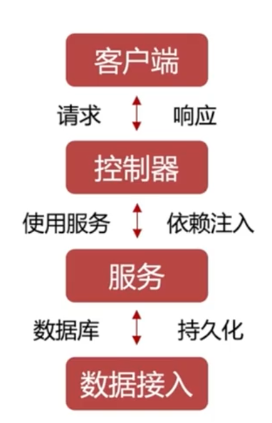
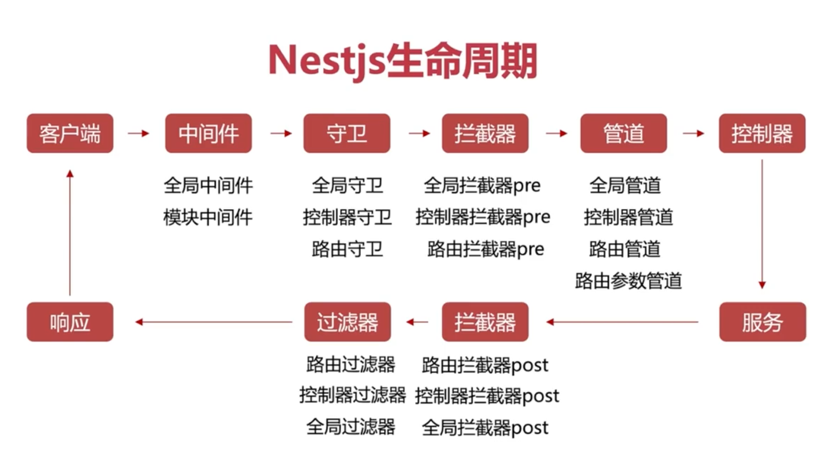
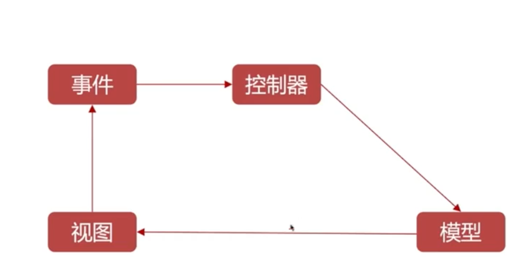
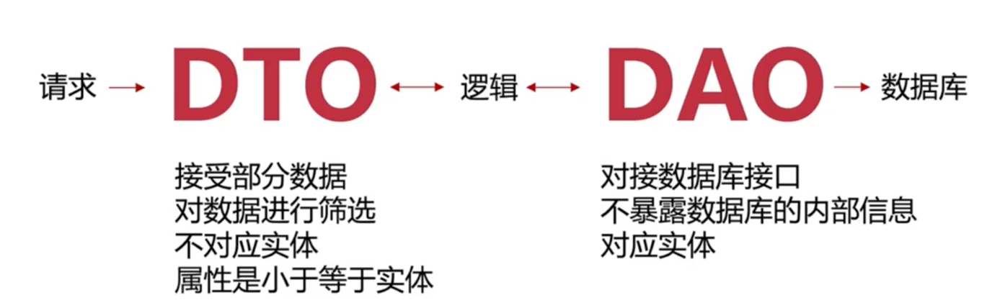

# Nest.js学习

## day01：Docker &&Nest体验

### 包管理工具

nvm` : 切换node版本     `nrm`: 切换源

`yarn`：特点扁平化依赖，并行安装，本地缓存

`pnpm`：节约磁盘空间  ，缓存技术加持

​		速度快    支持monorepo

​		安全性高

### Docker安装以及mysql环境搭建

需要打开DockerDeskTop 并在终端执行命令

在**docker hub**上面找到创建mysql指令

```
docker run --name some-mysql ........(不用:tag)
```

查看上传文件

```
docker ps
```

停止数据库

```
docker stop some-mysql
```

删除数据库

```
docker rm some-mysql
```

### Docker加速配置docker engine

### Docker配置Docker compose

> **Docker Compose**是一款帮助定义和共享多容器应用程序的工具，使用Compose,可以创建一个yaml文件定义容器服务，并且可以使用类似Docker的命令对内容进行管理

1. db:数据库，同样可以通过数据库容器的IP地址进行访问
2. image：镜像源
3. restart：每次启动Docker自动启动数据库服务

```
# Use root/example as user/password credentials

services:

  db:
    image: mysql
    restart: always
    environment:
      MYSQL_ROOT_PASSWORD: example
    # (this is just an example, not intended to be a production configuration)
    ports:
      - "3307:3306"

  adminer:
    image: adminer
    restart: always
    ports:
      - 8090:8080

```

**上面文件必须叫做docker-compose.yml**,创建了一个名为adminer的数据库，然后运行

```
docker-compose up -d
```

创建数据库并开启服务，进入localhost:8090进入登录，创建成功：


使用以下命令查看运行容器：

```
docker ps -a
```

使用以下命令查看容器IP地址：

```
docker inspect 容器名称
```


### Nestjs官方CLI

#### 全局下载脚手架

```
npm i -g @nestjs/cli
```

#### 创建项目

```
nest new nestjs-dome
```

(emmmm...第一次下载卡住了，又使用pnpm下载依赖，好多哇)

#### 检查创建

```
pnpm run start:dev
```

#### 模板资源合集

Awesome:https://github.com/nestjs/awesome-nestjs


### RESTful API

代表的是一种接口风格。架构如图：

#### 架构


#### 接口文档设计

- 需要`设计序言，全局参数、修改记录以及按照功能划分的接口描述`，
- 这个看黑马看了好多哩，他的设计挺好的，贴近前端需求！！
- 使用`postman`进行接口测试


### 进入代码文件

#### License

每个证书有其独特特点，具体如下：

在 Nest 项目（或任何开源项目）中选择不同的开源许可证（如 MIT、Apache 2.0、GPL 等）会影响项目的使用方式、分发限制和法律责任。以下是常见开源许可证的核心区别和适用场景：

##### . MIT 许可证

**特点**：

- **宽松自由**：允许商业使用、修改、分发、私用，无需保留原作者版权声明。
- **无限制**：无需提供源代码，无需共享修改。
- **免责声明**：作者不承担任何责任。

**适用场景**：

- 开源库、工具链、框架（如 Nest.js 官方采用 MIT）。

- 希望代码被广泛使用和集成的项目。

  ​

##### .Apache 2.0 许可证

**特点**：

- **商业友好**：允许商业使用，无需支付版税。
- **专利授权**：明确授予专利使用权。
- **修改需声明**：修改版本需保留版权声明和许可证文件。
- **无需共享修改**：闭源修改版本无需开源。

**适用场景**：

- 企业级项目（如 Apache 软件基金会旗下项目）。
- 需要专利保护的技术。

**与 MIT 的主要区别**：

- 包含专利授权条款。
- 修改版本需在 LICENSE 文件中说明变更。

#####  GPL 系列（如 GPLv3、LGPL）

**特点**：

- **强传染性**：修改或衍生作品必须采用相同许可证（开源）。
- **共享要求**：分发时必须提供完整源代码。
- **商业限制**：闭源商业产品集成 GPL 代码需开源。

**LGPL 特点**：

- **弱传染性**：仅要求修改的库本身开源，使用库的应用无需开源。

**适用场景**：

- 强调代码共享和开源精神的项目。
- 基础库（如 Linux 内核采用 GPLv2）。

**与 MIT 的主要区别**：

- 传染性强，可能限制商业闭源应用使用。

##### **4. BSD 系列（如 3-Clause BSD）**

**特点**：

- **类似 MIT**：允许自由使用、修改和分发。
- **禁止背书**：禁止用原作者名义推广衍生产品。

**与 MIT 的主要区别**：

- 包含禁止背书条款，减少法律风险。

##### **如何选择？**

| 需求                 | MIT             | Apache 2.0               | GPLv3               |
| -------------------- | --------------- | ------------------------ | ------------------- |
| **允许闭源商业使用** | ✅               | ✅                        | ❌（需开源衍生作品） |
| **需专利保护**       | ❌               | ✅                        | ❌                   |
| **修改需开源**       | ❌               | ❌                        | ✅                   |
| **简单易用**         | ✅（无额外要求） | ❌（需保留 LICENSE 文件） | ❌（复杂传染性）     |

##### **Nest 项目建议**

Nest.js 官方采用**MIT 许可证**，原因是：

1. **最大化生态**：鼓励开发者自由使用和扩展框架。
2. **商业友好**：企业可放心用于闭源产品。
3. **简化法律风险**：无复杂条款，降低合规成本。

如果你的 Nest 项目是：

- **开源库 / 插件**：建议跟随官方使用 MIT。
- **企业内部工具**：可选 MIT 或 Apache 2.0。
- **强开源理念项目**：可选 GPLv3（但可能限制用户群体）。

##### 插件 choose A License可直接创建许可证


### 工程目录-最佳实践

创建一个user  module

```
nest g  module user
```

创建测试user的controller

```
nest g controller user --no-spec
```

可以通过设置`main.ts`中的

```
async function bootstrap() {
  const app = await NestFactory.create(AppModule);
  app.setGlobalPrefix('api'); //设置这里为公共路由名
  await app.listen(process.env.PORT ?? 3000);
}
```


#### module.server.ts

属于**逻辑层**,目前来看相当于定义了一些方法在里面，方便调用：

```
//user.service.ts
import { Injectable } from '@nestjs/common';

@Injectable()
export class UserService {
	//定义了getUsers方法
  getUsers(): any {
    return { message: 'Hello users!', code: 200 };
  }
}

```

```
//user.controller.ts
import { Controller, Get} from '@nestjs/common';
import { UserService } from './user.service';

@Controller('user')
export class UserController {

  constructor(private useService: UserService) {}
  @Get()
  getUsers(): any {
  //直接构造器引入useService，然后使用里面的逻辑
    return this.useService.getUsers();
  }

}

```


### 第一天小节

很有意思，全新的语法以及后端思维的初步认识。controller是类似生成路由，service是逻辑方法！！！加油，坚持下去，jice19！！！


## day02：配置提效


### 热重载Hot Reload

> 可以理解为局部更新文件，不需要重新启动服务

**前端**由于需要频繁更新，自动配置热重载可以极高的提高效率

**后端**虽然逻辑写好之后不需要频繁变动，但是配置热重载依旧是提高效率的方法：`nest参照官网`进行配置，按照官网配完还差一步：

```
pnpm i -D @types/webpack-env
```

这样就实现了热重载的配置


### 调试配置

1、创建launch.json文件(配置运行脚本以及node版本)：

```
{
  // 使用 IntelliSense 了解相关属性。 
  // 悬停以查看现有属性的描述。
  // 欲了解更多信息，请访问: https://go.microsoft.com/fwlink/?linkid=830387
  "version": "0.2.0",
  "configurations": [
    {
      "name":"Launch via NPM",
      "request": "launch",
      "runtimeExecutable": "npm",
      "runtimeArgs": [
        "run-script",
        "start:debug"
      ],
      "skipFiles": [
        "<node_internals>/**",
        "**/node_modules/**"
      ],
      "type": "node",
      "runtimeVersion": "18.20.8" ,
      "sourceMap": true
     }
  ]
}
```


### IOC和DI

IOC(控制反转)：是一种面向对象编程中的一种**设计模式**，用来减低计算机代码之间的耦合度。

DI（依赖注入）：DI是IOC的**具体实现**，允许在类外创建依赖对象，通过不同方式给对象提供给类


### Nestjs核心概念

- Controller:  负责处理请求、返回响应

- Service：提供方法和操作，只包含业务逻辑

- Data Access：负责访问数据库中的数据

  

#### 生命周期



#### 模块化

- 功能模块
- 共享模块
- 全局模块
- 动态模块

功能模块与共享模块是一回事，只是叫法不一样

全局模块通常应用在配置、数据库连接、日志上

动态模块是在使用到模块的时候才初始化（懒加载）

  

### MVC   DTO  DAO


**MVC**:模型  视图  控制器   （是一种软件架构模式）



用户操作产生事件到达不同的控制器（可以理解为不同的路径），控制器传输信息给模型（处理数据库的服务）然后返回给前端视图

**DTO**：数据传输对象

1. ​	接收部分数据  
2. ​	对数据进行筛选



**DAO**：数据访问对象（操作数据库返回给前端）

1.   DAO是一层逻辑：包含`实体类`、`数据库操作`、`数据校验`和`错误处理`等
2. Nestjs封装了`ORM库`与类数据库对接，这些**ORM**库就是DAO层


### Nestjs核心 DI容器（理解之后写无敌）

1、首先是`module`模块进行一个初始化`service`服务，并且通过`providers`告诉nestjs把这个服务类初始化可以在本模块使用，

通过`exports`告诉nestjs这个服务类可以在其他模块导入使用

2、其次是`controller`中构造器获取DI中`已初始化的服务类`并且可以使用这个服务类


### 通用后端框架

#### 接口开发的核心技术

- 数据校验
- 数据库连接
- 权限控制
- 日志服务
- 错误异常
- 接口响应

#### 通用后端框架思考

- 从开发层面的思考：(多环境-》多配置-》配置管理与校验)
- 从功能层面的思考：(配置、日志、数据库、权限)
- 从接口安全的思考：(服务安全-》日志-》统计)


