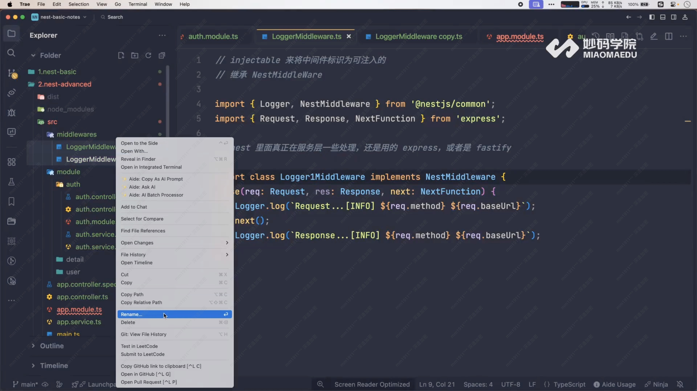
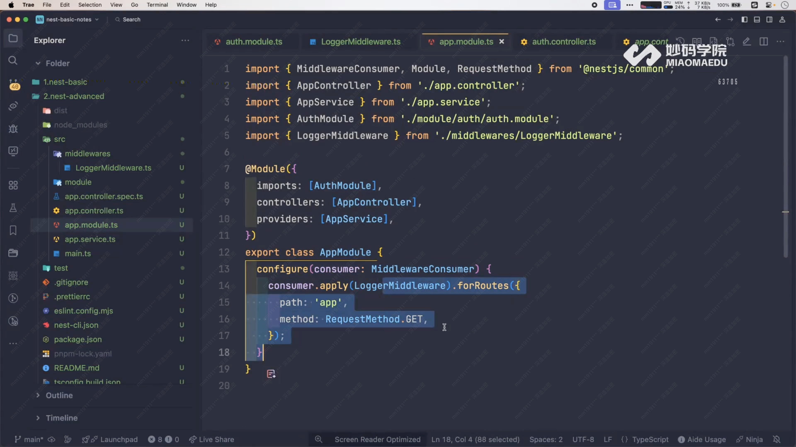

# Middleware 中间件详解



## 洋葱模型

中间件遵循洋葱模型 —— **先进后出**。

```
请求 → Mid1(前) → Mid2(前) → Controller → Mid2(后) → Mid1(后) → 响应
```

## 实现中间件

1. `@Injectable()` 装饰
2. `implements NestMiddleware`
3. 调用 `next()` 传递控制权

## 注册方式

```typescript
// 全局中间件 - main.ts
app.use(new LoggerMiddleware());

// 局部中间件 - module 中
consumer.apply(LoggerMiddleware).forRoutes('users');
```


