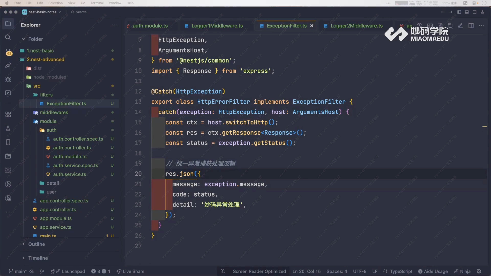
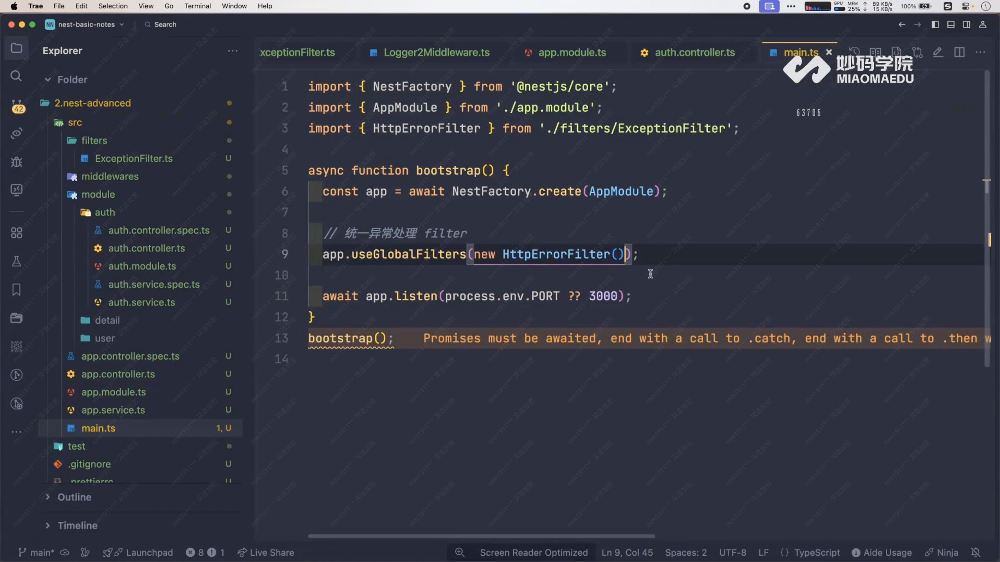

# Exception Filters 异常过滤器



## 作用

捕获项目中抛出的异常，统一格式化错误响应。

## 实现

- `@Catch()` 指定异常类型
- `implements ExceptionFilter`
- 实现 `catch(exception, host)`

## 使用方式

```typescript
// 局部
@UseFilters(HttpExceptionFilter)

// 全局
app.useGlobalFilters(new HttpExceptionFilter());
```


