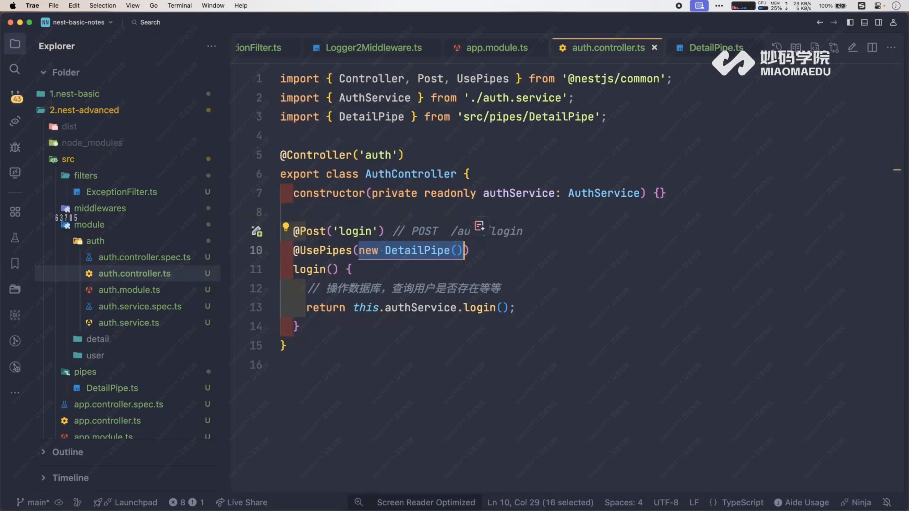

# Pipes 管道

## 作用

对请求数据进行 **转换** 和 **处理**。

## 实现

- `@Injectable()` 装饰
- `implements PipeTransform`
- 实现 `transform(value, metadata)`

## 常用场景

- 参数类型转换（string → number）
- 数据验证（class-validator）
- 默认值设置
